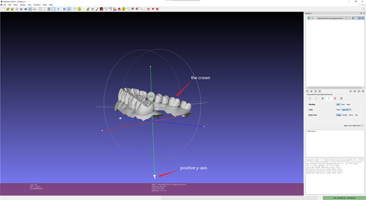
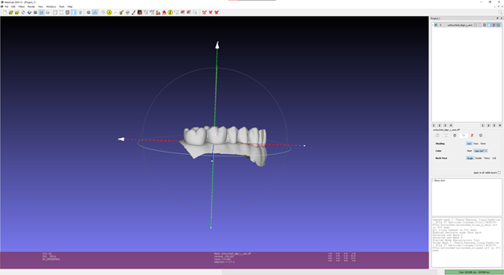
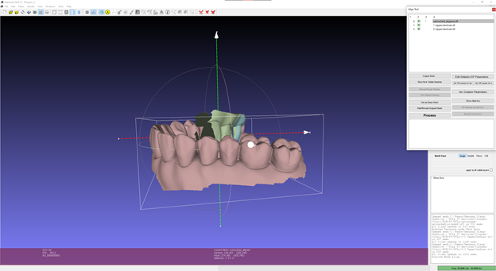
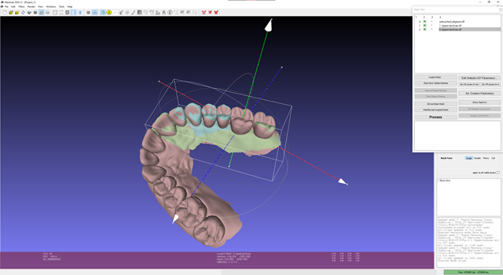
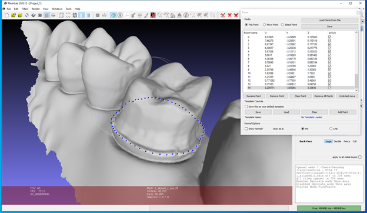
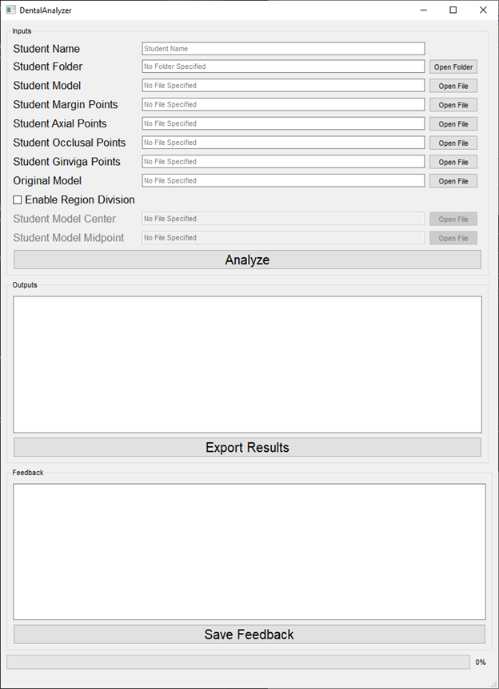

## Tutorial: How to prepare the data for Dental Analyzer
1. Before using Dental Analyzer, we need to do some preprocessing on the student prep and original prep. MeshLab is included in the installation package of Dental Analyzer. Go to the DentalAnalyzer folder, open MeshLab\meshlab.exe.

    

   Open MeshLab. Import **original prep** model by clicking Files->Import Mesh. Or you can import the model by directly dragging the mesh file to the MeshLab interface

    

2. After importing the original prep, the first thing is to check the ‘up’ direction of the crown that we are interested in aligns with **the positive y axis**. This is an important step because Dental Analyzer assumes the ‘up’ direction of the prep to be the **positive y** direction. Below is my method of aligning the crown with the y-axis.
   
    click on the coordinate button  on the tool bar to show the world axis. In this example, we see that the crown does not align with the y axis.

    

    Use the manipulator tool  on the tool bar to transform the mesh to the desired position. Follow the instructions to transform the mesh using your mouse.

    Tip: when you want to change the view when transforming, hit 'Esc' key to exit the manipulator mode so that you can change the view, and hit 'Esc' key again to return to the manipulator mode.

    In this example, I moved the crown to the origin so that I can check more easily whether it aligns with the y-axis.

    

    After aligning the model with the y-axis, save the transformation by Filters -> Mesh Layer -> Matrix: Freeze Current Matrix
    
    
    
    Finally, **Export the mesh in .OFF format** in File->Export Mesh As… The .OFF format prep model is what the Dental Analyzer takes as input. Don't close the window as we are going to use the aligned original prep in the next step.
3. Next, we will align the student models to the original prep model. Import the student prep models (there could be more than one) and original prep model (aligned to y-axis in step 3). We will use two student preps in this example.
   
   Click on the Alignment tool  on the toolbar, and a window should pop up.

    

    Since we want to align the student prep model to the original prep model, we will ‘glue’ the original prep model at its current place. Click the name of the original prep model in the window, and click ‘Glue Here Mesh’. An asterisk * should appear near the name of the original prep model.

    

    Then we will align the each student prep model with the original prep model. 
    
    For each student model, click the name of the student prep model, and then click ‘Point Based Glueing’, a new window should pop up.

    
    
    Select at least 4 matching pair of points on the two meshes. Double click to add points on each mesh. After finishing selecting the points, click OK, and the result should be similar to the following.

    

    Perform the same above alignment steps for each of the student models.

    

    Then, click ‘Process’, and MeshLab will further improve the alignment based on the ‘Point Based Glueing’ results using ICP. 

    

    Now all models have a position matrix that is different from the identity matrix. Since we want to assign the identity matrix to the original prep model, click the name of the original prep model, and click ‘Set as Base Mesh’. This will assign the identity matrix to the original prep model.

    

    Freeze (Filters -> Mesh Layer -> Matrix: Freeze Current Matrix) and save the aligned student preps as **.OFF files**.

4. Then we need to mark the lines (gingiva line, margin line, axial line, occlusal line) on the **student prep model**. These lines are required as input to Dental Analyzer. We will mark margin lines on the student prep model as an example.
Meshlab does not have tools to mark lines on the model. To get around this, we will mark a set of points on the model using the **PickPoints**  utility. You can find this tool near the middle of the tool bar in the MeshLab UI.
Open the .OFF file we saved for the student prep model in step 4, click on the PickPoints utility in the tool bar, a window should open on the upper-right corner of the screen.

    

    Untick the ‘Show Normal’ option at the bottom of the window, since we are not interested in normal of the points. Use right click to pick points, and if you want to move or rotate the model, use ‘Esc’ to toggle between PickPoints mode and normal mode. It is important that you pick points in a way that current point is next to previous point, i.e. you should pick points sequentially in space. 

    

    After finishing picking the points, save it as .pp file by clicking on the 'Save' button on the top right corner. Then, remove all the picked points in the window, and repeat the process for each of the four lines (gingiva line, margin line, axial line, occlusal line).


## Tutorial: How to use Dental Analyzer
1. Open the DentalAnalyzer, you should see an interface like the following.



The UI consists of 3 sections: Inputs, Outputs and Feedback.

In the ‘Input’ section, you need to input the file as requested. These files should be prepared according to the tutorial in the previous section (“How to prepare the data for Dental Analyzer”). 

Note: The 'Student Folder' is optional. If you specify the location of the folder containing the files, it will fill out the rest of the entries (except ‘Original Model’) using the format StudentFolder/DefaultName, the default name for each of the entry is as follows:
```
Model – model.off
Margin Points – margin_points.pp
Axial Points – axial_points.pp
Occlusal Points – occlusal_points.pp
Gingiva Points – gingiva_points.pp
Center – center_point.pp
Midpoint – mid_point.pp
```

If you want to divide the crown prep into 4 regions (Lingual, Buccal, Mesial and Distal), you can select the ‘Enable Region Division’ option, and you have to provide the center and midpoint of the student model, each as a .pp file.

Illustration of midpoint and center is as follows. They are used to determine the direction of a tooth, i.e. Lingual, Buccal, Mesial, Distal.


Below is an example after filling the inputs.


If you are finished with inputting the files, click on ‘Analyze’ to start the analysis, the results should be available in the ‘Output’ section.


You can export the results as .csv spreadsheet file by using the export results botton.

After taking a look at the outputs, you can write your feedback in the ‘Feedback’ section and save it as a .txt file.